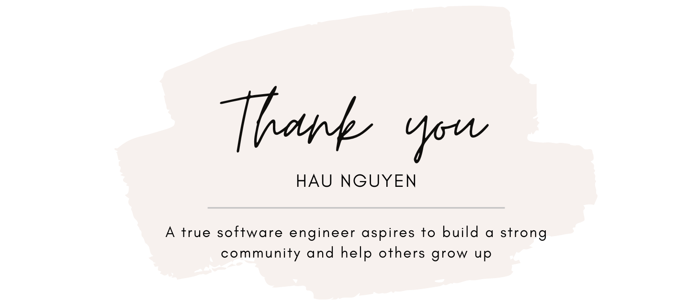
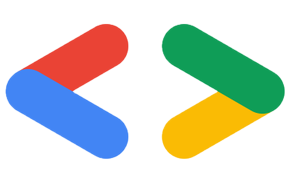

<h2 align="center">
    
      
    👋 Hi, I’m Leo N 🇻🇳 🇸🇬 🇲🇾 🇦🇺 🇹🇭 Engineer @ OKX | MSc 🎓 | Technical Writer
     
</h2> 

 I am a driven and team-oriented Software Engineer with over 10 years of experience in Android development, specializing in designing, developing, and delivering top-notch software solutions. Throughout my career, I have worked closely with designers, developers, and managers to build scalable and efficient applications that provide seamless user experiences. I hold a Vietnam – France joint Master's program (HCMUS + LYON 1) which has equipped me with a strong academic background in software engineering, data structures, algorithms, and system design. My enthusiasm for continuous learning and innovation inspires me to delve into cutting-edge technologies and industry best practices.
-------

"A person who never made a mistake never tried anything new." — Albert Einstein

-------
 
 I love to contribute to open source projects. I also write about software engineering, learning, and career to help readers. A true Software Engineer aspires to build a strong community and help other people grow up.

<h2 align="left">🛠️ Tech Stack</h2>

    
    
    
    
    
    
    
    
    
    
    
    
    
    

<h2 align="left">👨🏻‍💻 About Me</h2>

- 😄 Pronouns: /ˈliː.əʊ/

- 💻 I am working as Staff Software Engineer, Mobile

- 👀 I’m interested in Banking, Fintech, Blockchain

- ❤️ Open Source Software

- 🌱 I’m currently learning Deep Learning, Automation Test

<h2 align="left">📫 Connect with Me</h2>

- 📚  Writing [medium](https://nphausg.medium.com)

- 📫 How to reach me: nphausg@gmail.com

- 📫 LinkedIn: [in/nphausg](https://www.linkedin.com/in/nphausg/)

- 🔥 Twitter: https://twitter.com/nphausg

- <a href="https://g.dev/nphausg"> Google: https://g.dev/nphausg</a>

